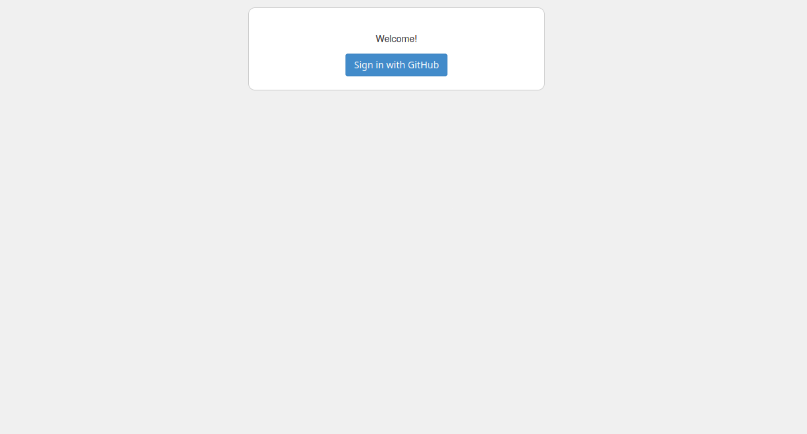
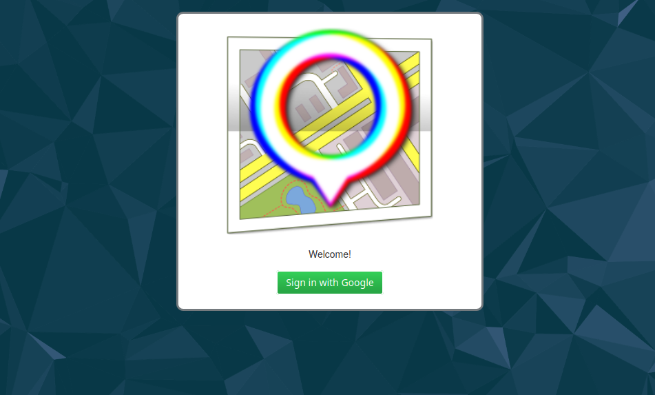

This is a Helm chart that extends the
(oauth2-proxy)[https://github.com/helm/charts/tree/master/stable/oauth2-proxy]
Helm chart with themes for the login page.

Out-of-the-box, the login page for oath2-proxy looks like this:



With this Helm chart we can add a theme and e.g. make the login page look like this:



The chart works by using the existing custom-html template feature of
oauth2-proxy together with an add-on web server for static assets (which cannot
be served by oath2-proxy).

# Installing

Create a client secret for oauth2-proxy to use - lookup details in the
(oauth2-proxy
documentation)[https://oauth2-proxy.github.io/oauth2-proxy/configuration].

```
kubectl create secret generic oauth-client-secret --from-literal=client-id=XXXXX --from-literal=client-secret=YYYYYYYYY --from-literal=cookie-secret=$(shell openssl rand -hex 16)
```

Oauth2-proxy supports custom HTML templates, i.e. create a ConfigMap with the
HTML templates for the login and error pages (both are needed if customizing one
of them):

```
kubectl create cm custom-html --from-file=example-theme/sign_in.html --from-file=example-theme/error.html
```

If e.g. the `sign_in.html` template use static assets like images, we need to
create another ConfigMap with those:

```
kubectl create cm custom-assets --from-file=example-theme/back.svg --from-file=example-theme/icon.png
```

These static assets can be referenced from the HTML templates under the sub-path `/assets`.

# Notes

If using large assets together with `kubectl apply`, you might hit upon the
max. size of 256k imposed by the Kubernetes API. Using server-side apply
(`kubectl apply --server-side=true`) will help mitigate this issue.

The icon shown above is from my
[OSMfocus](https://github.com/MichaelVL/osm-focus) Android app for
OpenStreetMap.